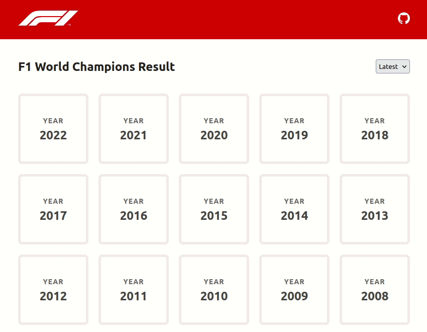

## Formula 1 - [Application](https://formula-1-eta.vercel.app/)

[](https://github.com/m-sureshraj/formula-1/actions?query=branch:main)



Formula 1 is a single page application that presents a list that shows
the F1 world champions starting from 2005 until now. Clicking on an item
shows the list of winners for every race for the selected year.

## Requirements

* Node.js >= v16.x.x
* [nvm](https://github.com/nvm-sh/nvm) (optional)

## Getting Started

First, clone the project to local:

```bash
> git clone git@github.com:m-sureshraj/formula-1.git
```

Navigate to the cloned project and install the project dependencies. Also, make sure you are using Node.js version `>= v16.x.x` to avoid
any dependency incompatibility issues.

> If you have `nvm` available on your system, run the `nvm use` command from the project root to switch to the correct Node.js version.

```bash
> cd </path/to/the/cloned/project>
> npm install
```

Run the development server:

```bash
> npm run dev
```

Open [http://localhost:3000](http://localhost:3000) with your browser to see the result. The page auto-updates as you edit the file.

## Tech Stack

* [Next.js](https://nextjs.org/) - For client side rendering & static side generation (SSG)
  * TypeScript
  * [CSS Modules](https://github.com/css-modules/css-modules) with [SCSS](https://sass-lang.com/) - Component scoped styles with CSS Modules
  * React [context](https://reactjs.org/docs/context.html) for shared states
  * Functional Components with [Hooks](https://reactjs.org/docs/hooks-intro.html)
* [React Query](https://react-query.tanstack.com/) - Data fetching & Caching
* [Cypress](https://www.cypress.io/) - For End-to-End (E2E) tests
* [ESLint](https://eslint.org/) & [Prettier](https://prettier.io/) - Code quality tools

## Design References

* [User Interfaces](https://www.figma.com/file/tZQT1zjdqSl4xlBYX4Slnm/formula-1?node-id=0%3A1)

## Technical Choices

* The application home page has been [statically generated](https://nextjs.org/docs/basic-features/pages#static-generation-with-data) at build time to improve the first contentful paint ([FCP](https://web.dev/first-contentful-paint/)).
Also, statically generated pages can be cached easily by CDNs. Which drastically reduces the page load time.

* The [react-query](https://react-query.tanstack.com/) package has been used for data fetching and caching.
Since the application is read-only (no mutations), we can fully utilize the
caching to improve the application performance. With caching, subsequent requests to a specific season page show the
results instantly without even showing the loader.

* [CSS Modules](https://github.com/css-modules/css-modules) package allows us to write component scoped styles without worries of selector name collisions or affecting other components’ styles.
Since Next.js supports CSS Modules out of the box, we can use it without configuring anything.

## Improvements

* Make the pages fully responsive
* [Server-side render](https://nextjs.org/docs/basic-features/pages#server-side-rendering) (SSR) the season result page to [improve](https://www.patterns.dev/posts/server-side-rendering/)
  the page's first contentful paint (FCP) and time to interactive (TTI).
* Document and test [reusable components](./components/ui) via [Storybook](https://storybook.js.org/)
* Configure git hooks via [Husky package](https://github.com/typicode/husky) to validate [commit messages](https://github.com/conventional-changelog/commitlint)
* Improve End-to-end tests via [Snapshot](https://www.cypress.io/blog/2018/01/16/end-to-end-snapshot-testing/) testing.
* Disable deployment tasks for specific commits to reduce resource usage. For example, commits that start with `docs:` don't have to trigger deployment or run E2E tests.
